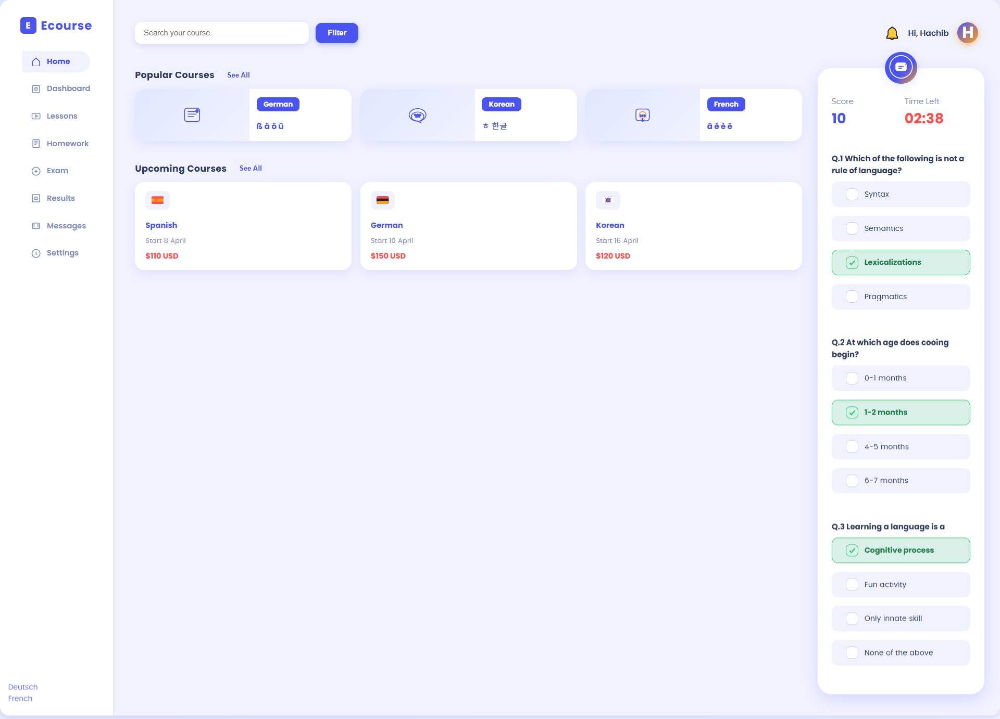

# Ecourse Dashboard

## عن الصفحة

لوحة تحكم تعليمية متطورة وشيك جدًا، معمولة بالكامل بـ HTML وCSS وJS بدون أي مكتبات خارجية.  
الصفحة متجاوبة وتظهر بشكل جميل على كل الأجهزة، مع سايدبار أنيق على اليسار وقائمة واضحة وسهلة.

## التصميم

- الألوان هادية وحديثة (بنفسجي، برتقالي، رمادي فاتح).
- كل أيقونة معمولة SVG ومختارة بعناية بدل الصور العادية.
- جزء Popular Courses و Upcoming Courses معمولين بكروت منفصلة وأنيقة.
- جزء الامتحانات (Online Exam) ثابت في مكانه، شكله احترافي، مع مؤقت ودرجات وسؤال متعدد.
- كل شيء متوزع بشكل عملي ومرتب، والمسافات واضحة.

## طريقة الاستخدام

- افتح الملف مباشرة في المتصفح.
- تقدر تعدل الكورسات أو الأسئلة أو الألوان من الكود بسهولة.
- لو حابب تضيف صورة للمعاينة، ضعها باسم `screenshot.png` في نفس الفولدر.

